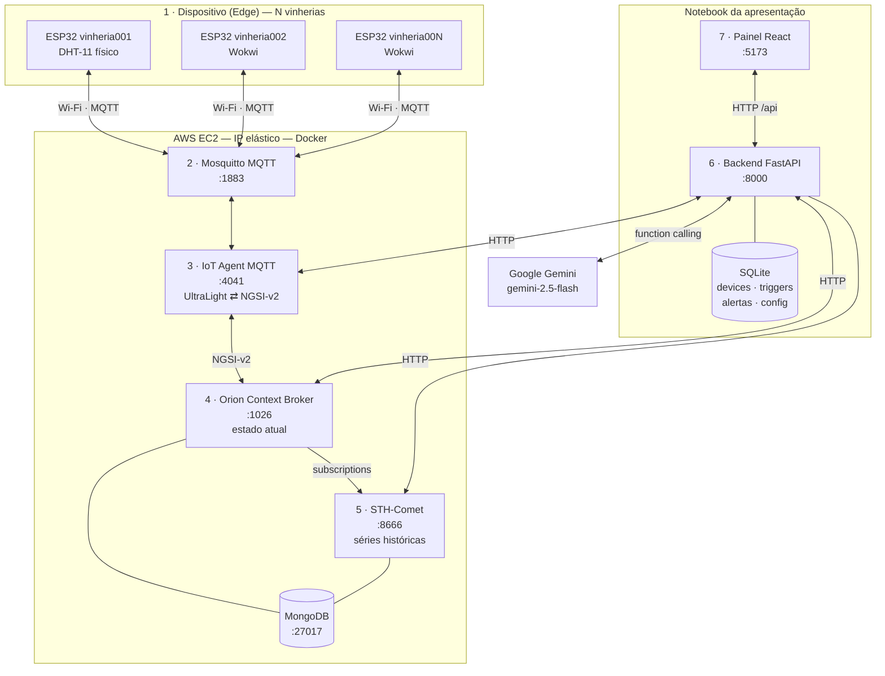
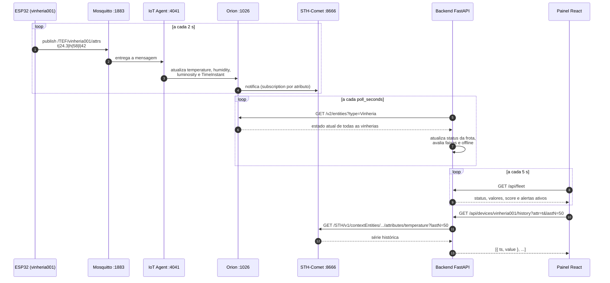
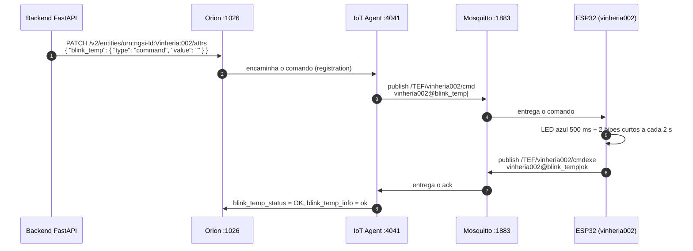
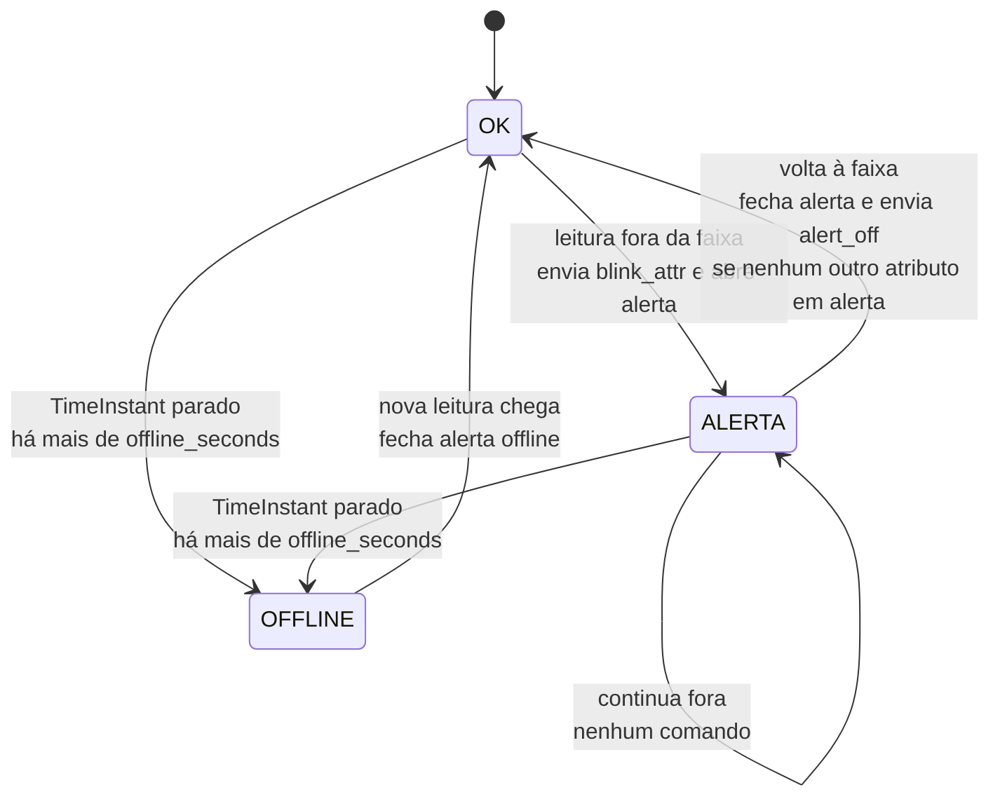
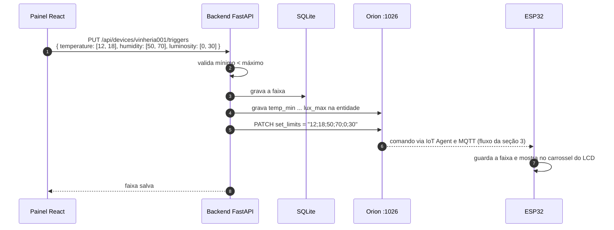
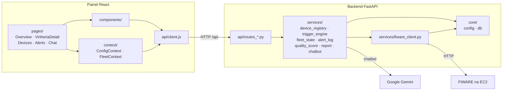
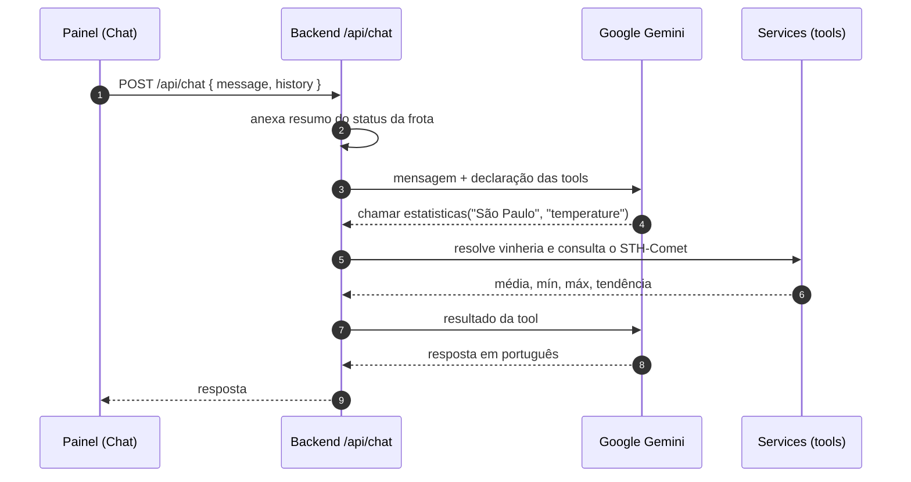

# Arquitetura — Smart Solutions: Monitoramento de Vinherias

Este documento descreve como as partes da solução se conectam: as camadas, os componentes de cada uma e os caminhos que os dados percorrem do sensor até a tela e da tela de volta ao dispositivo.

Os contratos completos (payloads de provisionamento, endpoints e regras) estão no [`PRD.md`](../PRD.md) e no [`PLANO-CP5-VINHERIA.md`](../PLANO-CP5-VINHERIA.md).

---

## 1. Visão em camadas

A solução tem sete camadas. Cada uma conversa só com a vizinha, o que permite trocar ou testar uma parte sem mexer nas outras.

| # | Camada | Onde roda | Componentes |
|---|---|---|---|
| 1 | Dispositivo (Edge) | Cada vinheria | ESP32, DHT-11 (DHT-22 no Wokwi), LDR, buzzer, LED azul, LCD 16x2 I2C |
| 2 | Comunicação | AWS EC2 | Wi-Fi + Mosquitto MQTT (1883), payload UltraLight 2.0 |
| 3 | Middleware IoT | AWS EC2 | IoT Agent MQTT (4041) |
| 4 | Contexto | AWS EC2 | Orion Context Broker (1026) + MongoDB (27017) |
| 5 | Persistência histórica | AWS EC2 | STH-Comet (8666) |
| 6 | Aplicação | Notebook (local) | Backend FastAPI + SQLite + Google Gemini |
| 7 | Apresentação | Notebook (navegador) | Painel React + Vite |

As camadas 2 a 5 são a stack `fabiocabrini/fiware` em containers Docker numa EC2 com **IP elástico**, então o endereço não muda quando a instância é desligada e religada.

Todas as vinherias usam o mesmo broker e o mesmo IoT Agent. Cada uma se diferencia pelo `device_id` (`vinheria00N`), que define os tópicos MQTT e a entidade no Orion (`urn:ngsi-ld:Vinheria:00N`, type `Vinheria`).

---

## 2. Fluxo de telemetria (sensor → tela)

A cada 2 segundos, cada ESP32 lê os sensores e publica uma linha UltraLight. O IoT Agent traduz os nomes curtos (`t`, `h`, `l`) para os nomes longos da entidade (`temperature`, `humidity`, `luminosity`) e preenche o `TimeInstant`. O Orion notifica o STH-Comet, que guarda o histórico. O backend lê o estado atual no Orion e o histórico no STH, e o painel lê o backend.

Pontos de atenção:

- O payload UltraLight usa os nomes curtos; Orion, STH-Comet, subscriptions e comandos usam os nomes longos.
- Se a leitura do DHT falha (`NaN`), o ESP32 não publica naquele ciclo.
- O backend faz **uma única** chamada ao Orion por ciclo para a frota inteira, não uma por vinheria.

---

## 3. Fluxo de comando (tela → dispositivo)

Comandos seguem o caminho inverso. O backend faz um `PATCH` no atributo de comando da entidade; o Orion encaminha ao IoT Agent (pela registration que o próprio IoT Agent cria ao provisionar o device), que publica no tópico `cmd` da vinheria. O ESP32 executa e responde no tópico `cmdexe`, e o resultado volta ao Orion.

Só a vinheria endereçada reage: as outras não assinam o tópico `/TEF/vinheria002/cmd`.

| Comando | Efeito no ESP32 |
|---|---|
| `blink_temp` | LED azul a cada 500 ms + 2 bipes curtos a cada 2 s |
| `blink_hum` | LED azul a cada 250 ms + 1 bipe longo a cada 3 s |
| `blink_lux` | LED azul a cada 125 ms + 3 bipes rápidos a cada 2 s |
| `alert_off` | apaga o LED e silencia o buzzer |
| `set_limits` | guarda a faixa ideal recebida e a mostra no LCD |

---

## 4. Motor de triggers e detecção de offline

A decisão de alertar fica no backend; o ESP32 só obedece. O motor guarda um estado por par `(vinheria, atributo)` e só envia comando quando esse estado muda, então uma leitura que continua fora da faixa não gera comandos repetidos.

- **Offline:** uma vinheria cujo `TimeInstant` no Orion não muda há mais de `offline_seconds` (padrão 30 s) é marcada como offline, ganha um alerta com `attr="offline"` e não recebe comandos até voltar.
- **Isolamento:** o estado de uma vinheria nunca afeta o das outras.
- **Registro:** cada alerta fica no SQLite com vinheria, atributo, valor, início, fim e duração.

---

## 5. Fluxo da faixa ideal

A faixa ideal (mínimo e máximo de temperatura, umidade e luminosidade) é definida pelo usuário por vinheria. Ela é ao mesmo tempo o limite dos alertas e a referência do score de qualidade. Ao salvar, o backend a propaga para o FIWARE e para o dispositivo.

A partir do próximo ciclo, o motor de triggers e o score já usam a faixa nova. A forma exata de gravar os atributos `*_min`/`*_max` no Orion será confirmada contra a EC2 na Task 4.

---

## 6. Cadastro e remoção de uma vinheria

**Cadastro** (`POST /api/devices` com `device_id`, nome e cidade):

1. Valida o formato `vinheria00N` e deriva a entidade `urn:ngsi-ld:Vinheria:00N`.
2. Garante o service group no IoT Agent (`apikey TEF`, `timestamp: true`).
3. Provisiona o device no IoT Agent com os atributos (`t`, `h`, `l`) e os comandos.
4. Cria no Orion uma subscription por atributo, apontando para o STH-Comet.
5. Envia a faixa padrão à entidade e ao ESP32.
6. Grava no SQLite. Se algum passo no FIWARE falha, o cadastro local é desfeito.

**Remoção** (`DELETE /api/devices/{id}`): apaga o device no IoT Agent, a entidade e as subscriptions dela no Orion, e o cadastro local. O histórico no STH-Comet é mantido.

---

## 7. Camada de aplicação por dentro

O backend segue camadas estritas: rotas recebem a requisição e chamam services; só o `fiware_client` faz HTTP com o FIWARE. No painel, componentes nunca chamam `fetch` direto, só o `api/client.js`.

| Módulo | Responsabilidade |
|---|---|
| `core/config.py` | Lê o `.env` e mantém a configuração em runtime (IP do FIWARE, portas, intervalos) |
| `core/db.py` | Conexão e schema do SQLite |
| `services/fiware_client.py` | Única porta de saída HTTP para IoT Agent, Orion e STH-Comet |
| `services/device_registry.py` | Cadastro, remoção e busca de vinherias por id, nome ou cidade |
| `services/trigger_engine.py` | Ciclo do poller: compara leituras, detecta offline, envia comandos |
| `services/fleet_state.py` | Retrato em memória do status de todas as vinherias |
| `services/alert_log.py` | Abre, fecha e consulta alertas |
| `services/quality_score.py` | Score de 0 a 100 a partir da faixa ideal |
| `services/report.py` | Relatórios CSV e PDF |
| `services/chatbot.py` | Gemini com function calling sobre os services acima |

O IP do FIWARE vem do `.env` (`FIWARE_HOST`) e pode ser trocado em runtime pelo painel Avançado; o `fiware_client` monta as URLs a cada chamada a partir da configuração atual, sem reiniciar o backend.

---

## 8. Chatbot

O chatbot não acessa o FIWARE diretamente: ele chama funções do backend (tools), que usam os mesmos services do painel. A vinheria é citada em texto livre ("a de São Paulo", "vinheria002") e resolvida no backend.

Tools disponíveis: `listar_vinherias`, `estado_atual`, `estatisticas`, `comparar`, `alertas` e `limites`. O loop de function calling tem no máximo 5 iterações por pergunta.
